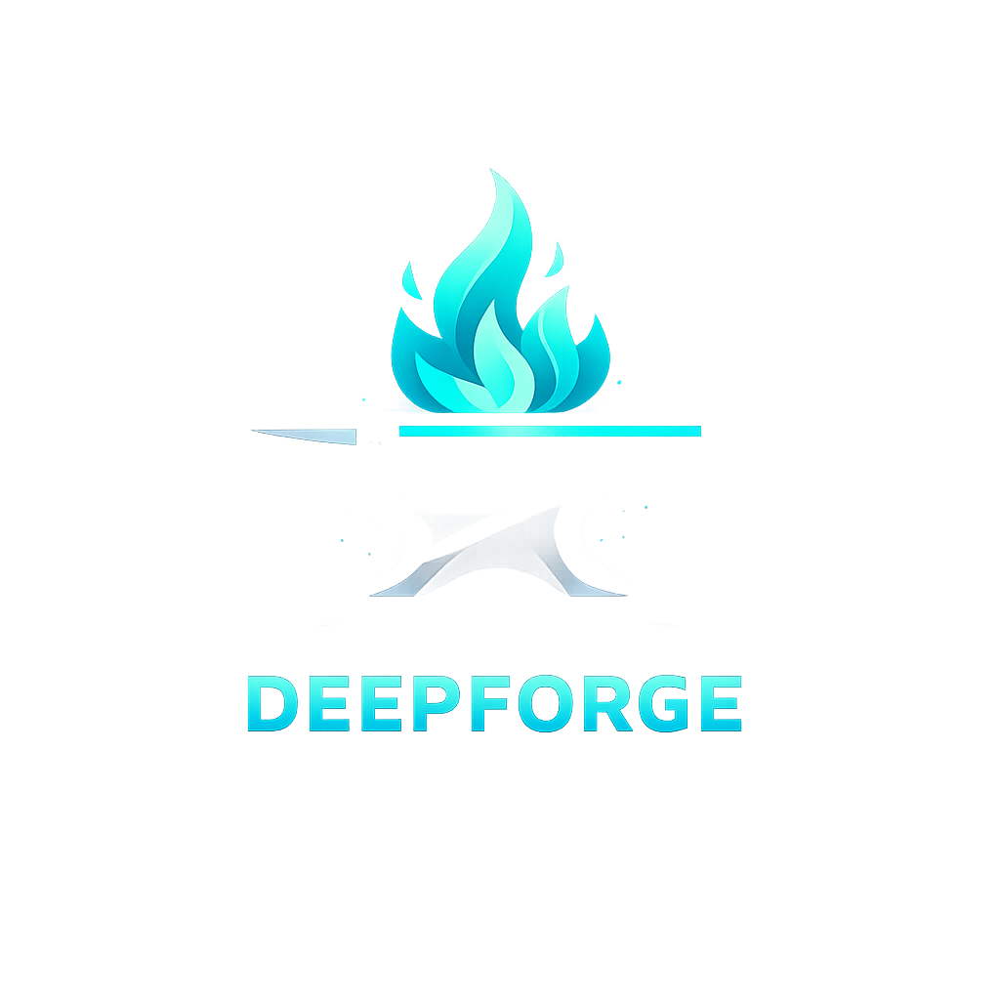

<p align="center">
  
</p>
<h1 align="center">
  Deepforge Theme for VS Code
</h1>
<p align="center">
  A premium dark VS Code theme forged for deep focus, clean contrast, and modern development workflows for <a href="https://deepforge-theme.netlify.app/">VS Code</a>.
</p>
<p align="center">
  <a href="https://marketplace.visualstudio.com/items?itemName=EdgarAmpiire.deepforge">
    
  </a>
  <a href="https://marketplace.visualstudio.com/items?itemName=EdgarAmpiire.deepforge">
    
  </a>
  <a href="https://marketplace.visualstudio.com/items?itemName=EdgarAmpiire.deepforge">
    
  </a>
</p>


# Deepforge

A premium dark VS Code theme forged for deep focus, clean contrast, and modern development workflows.

Deepforge combines a rich navy foundation with carefully selected teal, blue, purple, yellow, and soft red accents to create a coding environment that feels elegant, immersive, and easy on the eyes.

Designed for developers who value readability, aesthetics, and long coding sessions.

---

## Features

- Deep navy background for reduced eye strain
- Teal accent highlights for a clean modern feel
- Carefully balanced syntax colors
- Optimized sidebar, tabs, status bar, and terminal UI
- Beautiful support for HTML, JSX, TSX, Ruby, JavaScript, and general development workflows
- Premium contrast and visual hierarchy

---

## Color Palette

| Element | Color |
|---|---|
| Background | `#0a1830` |
| Secondary Background | `#0d1e3a` |
| Accent | `#2BCBBA` |
| Functions | `#89b4fa` |
| Keywords | `#cba6f7` |
| Strings | `#a6e3a1` |
| Types | `#f9e2af` |
| Numbers | `#fab387` |
| Errors | `#f38ba8` |
| Text | `#cdd6f4` |

---

## Preview

Deepforge is built to make your code visually clear:

- **keywords** stand out in soft purple
- **functions** shine in cool blue
- **strings** are calm green
- **numbers and parameters** use warm amber tones
- **comments** stay muted and elegant

Perfect for backend, frontend, and Rails workflows.

---

## Installation via VS Code Marketplace

1. Open **Extensions** sidebar panel in VS Code. `View → Extensions`
2. Search for **Deepforge**
3. Click Install
4. Open Command Palette
5. Select `Preferences: Color Theme`
6. Choose **Deepforge**

---

## Recommended Settings

For the best experience:

```json
{
  "editor.fontLigatures": true,
  "editor.cursorSmoothCaretAnimation": "on",
  "editor.smoothScrolling": true,
  "workbench.iconTheme": "material-icon-theme"
}
```

---

## Best Font Pairings

Deepforge pairs beautifully with:

- JetBrains Mono
- Fira Code
- Cascadia Code
- Geist Mono

Recommended:

```json
"editor.fontFamily": "JetBrains Mono"
```

---

## Built By

Crafted with intention by **Edgar Ampiire**

Forged for focus. Built for developers.

---

## Support

If you enjoy Deepforge, please leave a rating and share it with other developers.
